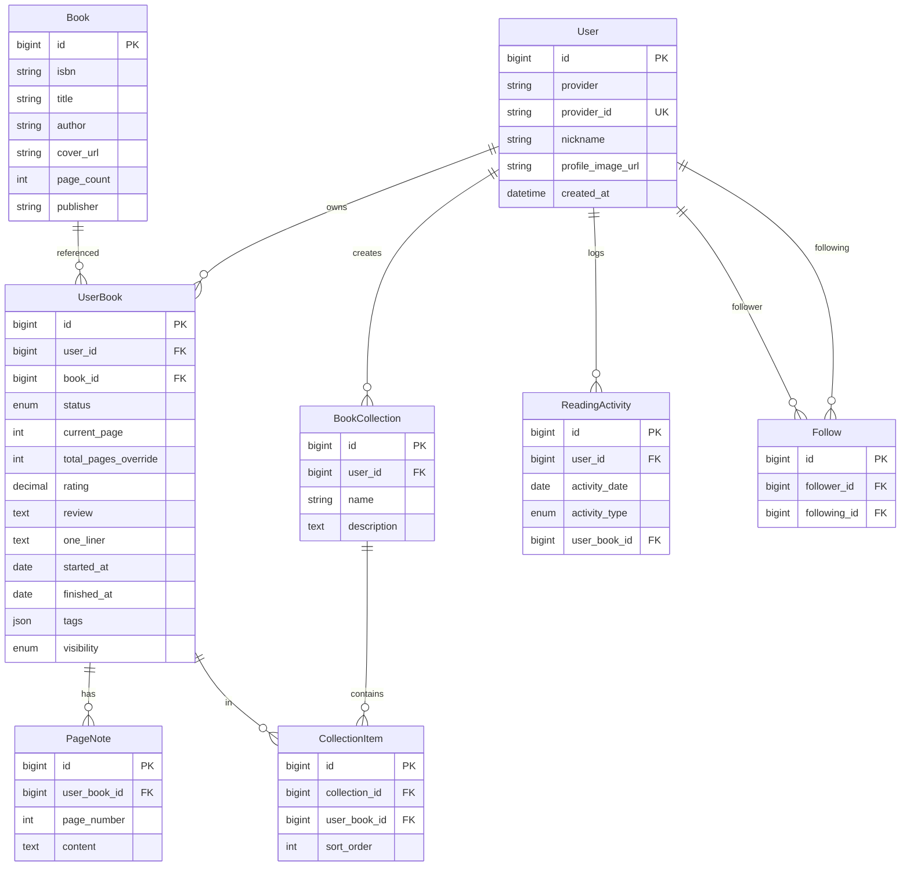

# BookLog ERD

## 엔티티 관계

## Enum

### ReadingStatus

- `WANT_TO_READ` — 읽고 싶음
- `READING` — 읽는 중
- `FINISHED` — 완독
- `DNF` — 읽다 멈춤

### Visibility (Phase 2)

- `PUBLIC` — 전체 공개
- `FOLLOWERS` — 팔로워만
- `PRIVATE` — 나만 보기 (기본값)

### ActivityType

- `PAGE_UPDATE`, `NOTE_ADDED`, `STATUS_CHANGED`, `FINISHED`
